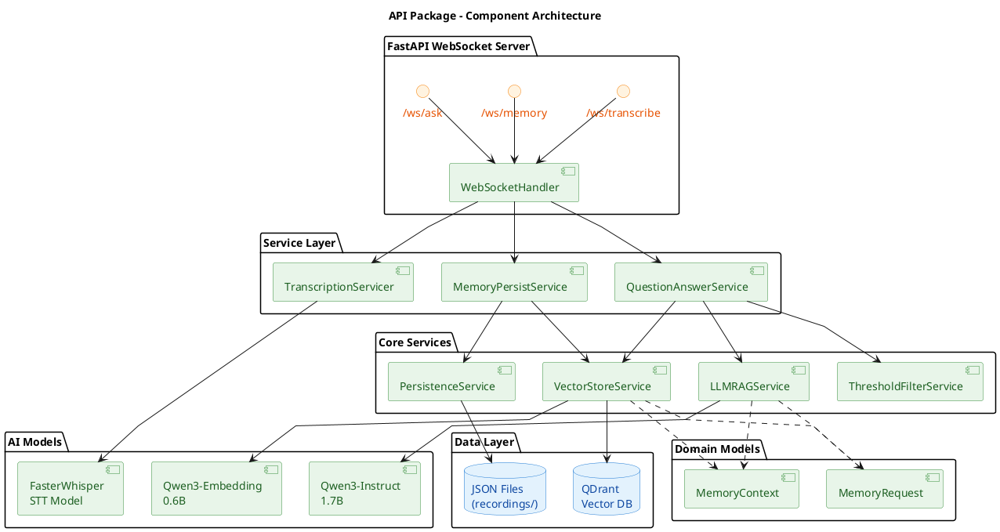

# API Package (Backend Server) Architecture

The API Package provides the backend server for the Momento intelligent memory system. It implements a FastAPI-based WebSocket server that handles real-time speech transcription, memory storage, and intelligent question answering using retrieval-augmented generation (RAG).

> **Note:** The name "API Package" stems from its role in defining, implementing, and exposing the application programming interface (API) using FastAPI for the Momento system, allowing clients (like the web frontend) to interact with its core functionalities.

## Overview

The API architecture is designed with modularity, scalability, and real-time performance in mind, enabling users to:

- **Transcribe audio in real-time**: Stream audio data and receive immediate transcription feedback using Faster Whisper
- **Store memories with semantic indexing**: Automatically chunk, embed, and index memories in a vector database for semantic search
- **Answer questions intelligently**: Retrieve relevant memories and generate contextual answers using local LLM models
- **Maintain clean separation of concerns**: Leverage dependency injection for testable, swappable components

## Architecture Components

### [WebSocket Endpoints](websocket_endpoints.md)

Three specialized WebSocket endpoints (`/ws/transcribe`, `/ws/memory`, `/ws/ask`) handle bidirectional streaming communication using Protocol Buffers for efficient data serialization.

### [AI Models](models.md)

Local AI models for speech-to-text (Faster Whisper), text embeddings (Qwen3-Embedding), and text generation (Qwen3-Instruct), all running without external API dependencies.

### [Core Services](services.md)

Modular services implementing vector storage (`VectorStoreService`), file persistence (`PersistenceService`), RAG processing (`LLMRAGService`), and relevance filtering (`ThresholdFilterService`) with clear interfaces and responsibilities. Services are assembled using container-based dependency injection for testability and flexibility.

## Architecture



## Key Design Principles

### 1. Dependency Injection

All components are assembled through the `Container` class, which:

- Creates and configures all dependencies at startup
- Enables easy swapping of implementations (e.g., different embedding models)
- Improves testability by allowing mock injection
- Keeps configuration centralized

### 2. Repository Pattern

Data access is abstracted behind repository interfaces:

- `VectorStoreRepository` for QDrant operations
- `FileRepository` for JSON persistence
- Allows switching storage backends without changing business logic

### 3. Service Layer Architecture

Business logic is organized into focused services:

- Each service has a single, clear responsibility
- Services depend on abstractions, not concrete implementations
- Async/await patterns for non-blocking I/O operations

### 4. Domain-Driven Design

Core domain models (`MemoryRequest`, `MemoryContext`) represent business concepts:

- Rich domain objects with behavior, not just data containers
- Factory methods for object creation
- Encapsulation of domain logic

### 5. Streaming-First Design

All major operations support streaming:

- Audio transcription streams results as they're produced
- RAG responses stream token-by-token for better UX
- WebSocket protocol enables bidirectional streaming

## Data Flows

The system implements two primary data flows for handling memory operations.

### Memory Storage Flow

```
Client sends audio/text → Buffer chunks → Create MemoryRequest → Save to JSON
→ Chunk text → Generate embeddings → Store in QDrant → Return memory ID
```

### Question Answering Flow

```
Client sends question → Buffer chunks → Generate embedding → Search QDrant
→ Filter by threshold → Stream contexts → Generate answer (RAG) → Stream tokens
```

## Technology Stack

- **Web Framework**: FastAPI with WebSocket support
- **Protocol**: Protocol Buffers (protobuf) for message serialization
- **STT Model**: Faster Whisper (local inference)
- **Embedding Model**: Qwen3-Embedding-0.6B (GGUF quantized)
- **LLM Model**: Qwen3-1.7B-Instruct (GGUF quantized)
- **Vector Database**: QDrant (in-memory mode)
- **Model Runtime**: llama.cpp for GGUF model inference
- **Text Processing**: spaCy for sentence chunking

## Scalability Considerations

The current architecture is designed as a single-instance deployment suitable for personal use with 1-10 concurrent users. The in-memory vector store provides fast access but naturally limits the total memory count based on available RAM. Local model inference enables complete offline operation without external API dependencies.
