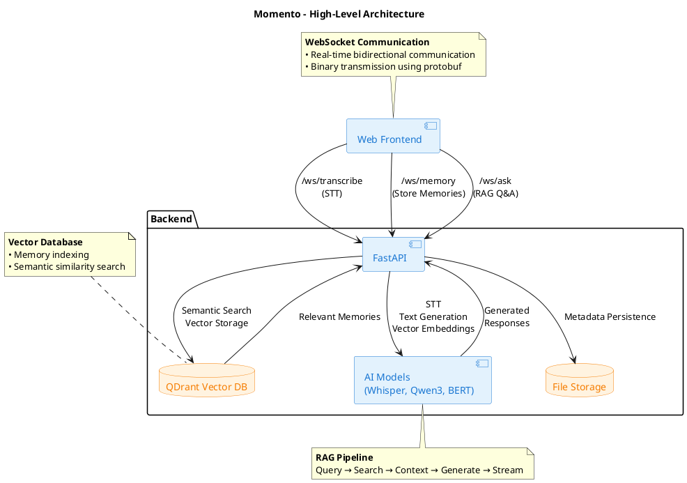

# Momento - Intelligent Memory Experience System

**Momento** is a memory prosthesis system that transforms spoken or written content into searchable memories. It can capture memories, experiences, or personal notes via text or real-time speech-to-text transcription, then organizes this information into a semantic memory system that you can query naturally using everyday language.

The system combines advanced AI technologies including automatic speech recognition (ASR) and retrieval-augmented generation (RAG) to create an intelligent memory assistant that helps you remember and recall information when you need it.

## Overview

Momento transforms spoken or written content into searchable memories, enabling users to:

- **Record and transcribe** audio in real-time using advanced speech recognition
- **Store memories** with intelligent vector-based indexing for semantic search
- **Query memories** using natural language questions with AI-powered responses
- **Interact seamlessly** through a modern web interface with real-time WebSocket communication

### The Memory Prosthesis Concept

Memories and experiences are freshest and most detailed shortly after they occur. Over days, weeks, or years, these memories degrade in information content and fade - a natural feature of the human brain. Momento addresses this by providing an external memory prosthesis that:

- Captures information while it's fresh and detailed
- Preserves context and connections between memories
- Enables easy retrieval through natural language queries powered by RAG
- Keeps all your data private and local - nothing leaves your machine

### Documentation Contents

This documentation aims to provide a comprehensive overview of the architecture, components, design choices, API references, and functionalities of the Momento system. It is not a user guide or marketing material, but rather a technical resource for developers, contributors, and anyone interested in understanding the system's inner workings.

The evaluation section additionally provides the analysis and results from benchmarking different RAG configurations across multiple datasets that were assessed during development. See the [Evaluation > Analysis](https://memory-experience.github.io/momento/evaluation/analysis/evaluation_ms_marco_passage/) section for details.

At the end of the documentation we reference the README files (the same ones found in the GitHub repository) from each package in the monorepo for additional context on setup, development, and usage. Note that these files may contain some overlapping information with this documentation, but they focus more on setting up and running the individual packages, while this documentation provides a holistic view of the entire system architecture and design.

## High-Level Architecture

## Key Features

### Audio & Text Input

- Real-time speech-to-text transcription
- Direct text input support
- WebSocket-based streaming communication

### Memory Storage

- Automatic text chunking and vector embedding generation
- Semantic indexing in QDrant vector database
- File-based persistence of metadata

### Intelligent Retrieval

- Natural language question processing
- Semantic similarity search across stored memories
- Context filtering by relevance thresholds

### AI-Powered Responses

- RAG-based answer generation using Qwen3 LLM
- Streaming response delivery
- Context-aware answers based on retrieved memories
