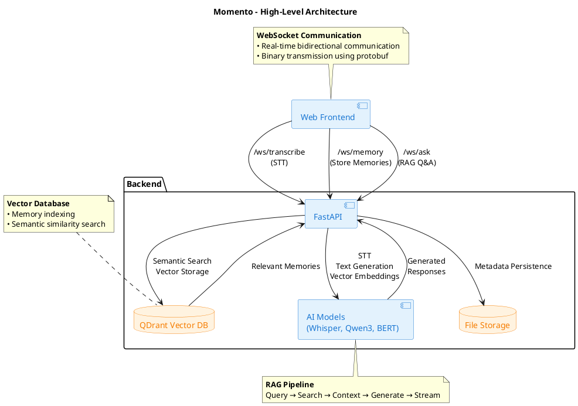

# Momento - Intelligent Memory Experience System

Momento is a sophisticated intelligent memory storage system with retrieval capabilities. It combines advanced AI technologies including speech-to-text for dictation, vector embeddings, and retrieval-augmented generation (RAG) to create an intelligent memory assistant that can capture, store, and answer questions about your memories and experiences.

## Overview

Momento transforms spoken or written content into searchable memories, enabling users to:

- **Record and transcribe** audio in real-time using advanced speech recognition
- **Store memories** with intelligent vector-based indexing for semantic search
- **Query memories** using natural language questions with AI-powered responses
- **Interact seamlessly** through a modern web interface with real-time WebSocket communication

## High-Level Architecture

## Key Features

### Audio & Text Input

- Real-time speech-to-text transcription
- Direct text input support
- WebSocket-based streaming communication

### Memory Storage

- Automatic text chunking and vector embedding generation
- Semantic indexing in QDrant vector database
- File-based persistence for audio and metadata

### Intelligent Retrieval

- Natural language question processing
- Semantic similarity search across stored memories
- Context filtering by relevance thresholds

### AI-Powered Responses

- RAG-based answer generation using Qwen3 LLM
- Streaming response delivery
- Context-aware answers based on retrieved memories
