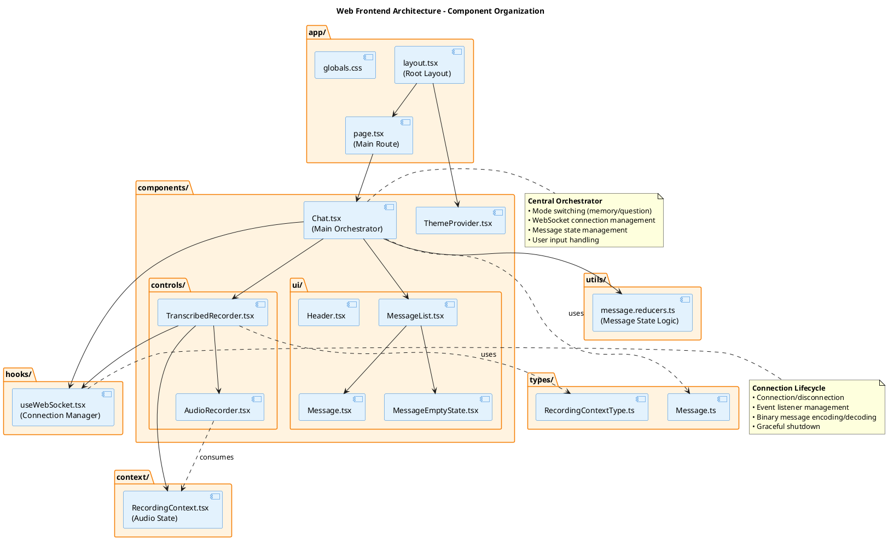

# Architecture

The Momento web frontend is a [Next.js](https://nextjs.org/) application that provides a real-time interface for memory storage and question-answering capabilities. The architecture leverages modern React patterns and WebSocket-based communication to enable seamless interaction with the backend AI services.

## Technology Stack

### Framework and Runtime

**[Next.js 15](https://nextjs.org/)** with the [App Router](https://nextjs.org/docs/app) provides the foundation:

- **React Server Components**: Enables server-side rendering for improved performance
- **File-based routing**: Automatic route generation from the `app/` directory structure
- **Built-in optimization**: Automatic code splitting, image optimization, and font loading
- **TypeScript support**: Full type safety across the application

**Why Next.js?** While the application currently operates as a client-side single-page application (no server-side rendering is actively used for dynamic content), Next.js provides:

- Excellent developer experience with hot module replacement
- Optimized production builds with automatic code splitting
- Future extensibility for server-side rendering if needed
- Industry-standard tooling and conventions

### UI Framework

**[Material UI Joy](https://mui.com/joy-ui/getting-started/)** provides the component library:

- Accessible, customizable components following Material Design principles
- Built-in dark mode support via theme provider
- Consistent design system across the application

### Communication Protocol

**WebSockets with Protocol Buffers** enable efficient real-time communication:

- Binary message encoding using [Protocol Buffers](https://protobuf.dev/) for minimal payload size
- Bidirectional streaming for real-time transcription and answer generation
- Three specialized endpoints for different interaction modes (see [Communication](communication.md))

## Project Structure

### Directory Overview

The `packages/web` workspace follows Next.js conventions with additional structure for maintainability:

#### `app/`

The Next.js App Router directory containing route definitions and layouts:

- **`page.tsx`**: Root route (`/`) that renders the main `Chat` component
- **`layout.tsx`**: Root layout providing theme context and global styles
- **`globals.css`**: Global CSS styles and Tailwind directives

Following the [Next.js App Router](https://nextjs.org/docs/app/building-your-application/routing) paradigm, this directory structure automatically defines the application's routing.

#### `components/`

React components organized by functionality:

- **`Chat.tsx`**: Main orchestrator component managing mode switching, WebSocket connections, and message flow
- **`controls/`**: Input control components
    - `AudioRecorder.tsx`: Microphone access and audio capture
    - `TranscribedRecorder.tsx`: Combines audio recording with real-time transcription
- **`ui/`**: Presentational UI components
    - `MessageList.tsx`: Renders conversation history
    - `Message.tsx`: Individual message display with sender differentiation
    - `Header.tsx`: Application header
    - `MessageEmptyState.tsx`: Empty state when no messages exist
- **`ThemeProvider.tsx`**: Material UI theme configuration and provider

#### `hooks/`

Custom React hooks encapsulating reusable logic:

- **`useWebSocket.tsx`**: WebSocket connection management with lifecycle control, event listeners, and graceful disconnection handling

#### `context/`

React Context providers for cross-component state:

- **`RecordingContext.tsx`**: Audio recording state (recording status, callbacks for start/stop/data handling)

#### `types/`

TypeScript type definitions:

- **`Message.ts`**: Message structure for chat interface (`Message`, `MessageSender`)
- **`RecordingContextType.ts`**: Type definitions for recording context state and callbacks

#### `utils/`

Utility functions and helper logic:

- **`message.reducers.ts`**: State reduction logic for streaming message updates, including handling of "thinking" markers (`<think>...</think>`) used by the LLM during response generation

#### `public/`

Static assets served directly:

- Images, fonts, favicons, and other static resources

## Architecture Patterns

### Component-Based Architecture

The frontend follows React's [component-based architecture](https://react.dev/learn/thinking-in-react), decomposing the UI into reusable, composable pieces. Components are organized by responsibility:

- **Container components** (e.g., `Chat`): Manage state and business logic
- **Presentational components** (e.g., `MessageList`, `Message`): Focus on rendering UI
- **Control components** (e.g., `AudioRecorder`): Handle user input and interactions

### Custom Hooks Pattern

The `useWebSocket` hook demonstrates the [custom hooks pattern](https://react.dev/learn/reusing-logic-with-custom-hooks), encapsulating WebSocket logic for reuse across components. This separates connection management from component logic, improving testability and maintainability.

### Context API for State

The application uses React's [Context API](https://react.dev/reference/react/useContext) for state that needs to be accessed by multiple components without prop drilling. Currently, only `RecordingContext` uses this pattern for audio recording state shared between `TranscribedRecorder` and `AudioRecorder`.

### Reducer Pattern for Complex State

The `reduceQuestionMessages` function in `message.reducers.ts` implements a reducer pattern for managing complex message state updates during streaming responses. This pure function approach makes the state logic predictable, testable, and easier to reason about.

## Communication with Backend

The frontend communicates with the Python FastAPI backend via three specialized WebSocket endpoints, each serving distinct purposes:

1. **`/ws/transcribe`**: Real-time speech-to-text transcription
2. **`/ws/memory`**: Memory storage and confirmation
3. **`/ws/ask`**: Question answering with retrieval-augmented generation

All communication uses binary Protocol Buffers encoding for efficient data transmission. The `useWebSocket` hook provides a consistent interface for managing these connections with proper lifecycle handling and graceful disconnection.

For detailed information about the communication protocol and message flows, see [Communication](../communication).
