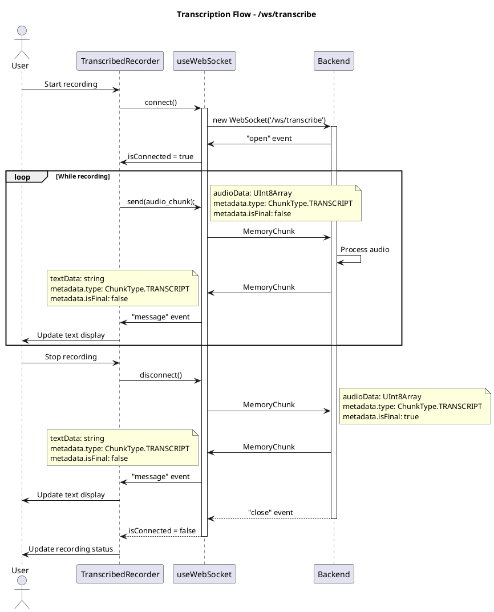
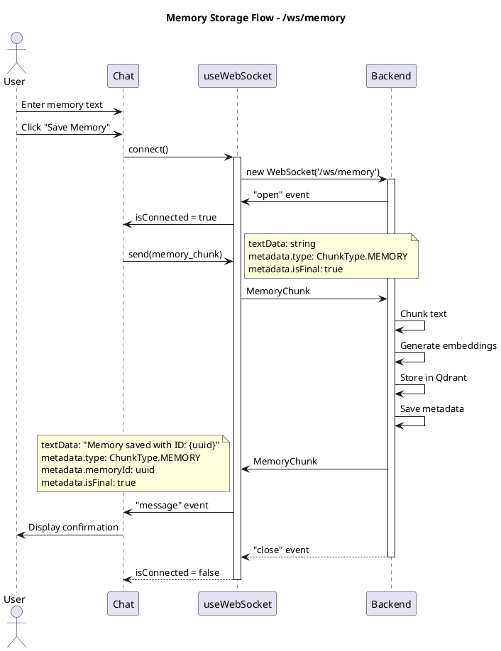
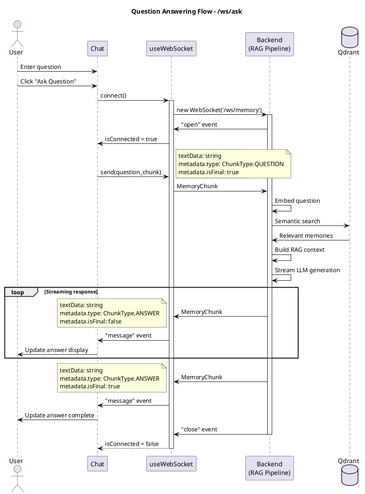

# Communication

The Momento web frontend communicates with the backend using WebSocket connections and Protocol Buffers for efficient, real-time bidirectional data exchange. This architecture enables streaming responses between the client and server while maintaining minimal latency and payload size.

## Protocol Buffers

All WebSocket messages use [Protocol Buffers](https://protobuf.dev/) (protobuf) for binary encoding. This choice provides several advantages over JSON:

- **Smaller payload size**: Binary encoding is significantly more compact than text-based JSON
- **Type safety**: Schema-defined message structure with code generation for TypeScript
- **Versioning**: Forward and backward compatibility through field numbering
- **Performance**: Faster serialization/deserialization compared to JSON parsing

The communication protocol is defined in [`stt.proto`](https://github.com/Memory-Experience/momento/blob/main/packages/protos/stt.proto).

### Generated TypeScript Bindings

The protobuf schema is compiled to TypeScript using `protoc` with the `ts-proto` plugin, generating type-safe encoding/decoding functions. The generated files may be imported as follows:

```typescript
import { MemoryChunk, ChunkType } from "protos/generated/ts/stt";

// Encoding
const chunk: MemoryChunk = {
    textData: "Hello world",
    metadata: {
        sessionId: "session-123",
        memoryId: "",
        type: ChunkType.MEMORY,
        isFinal: true,
        score: 0,
    },
};
const encoded = MemoryChunk.encode(chunk).finish(); // Uint8Array

// Decoding
const decoded = MemoryChunk.decode(encoded);
```

## WebSocket Endpoints

The frontend connects to three specialized WebSocket endpoints, each serving a distinct purpose in the application's workflow.

### 1. `/ws/transcribe` - Speech-to-Text Transcription

**Purpose**: Converts audio input to text in real-time using the Whisper model.

**Client sends**: Audio chunks encoded as `MemoryChunk` with:

- `audioData`: Raw PCM audio bytes (16-bit, 16kHz mono)
- `metadata.type`: `ChunkType.TRANSCRIPT`
- `metadata.isFinal`: `false` for chunks, `true` to signal end

**Server responds**: Transcribed text segments as `MemoryChunk` with:

- `textData`: Transcribed text fragment
- `metadata.type`: `ChunkType.TRANSCRIPT`
- `metadata.isFinal`: `true` once processing final segment indicated by client, otwherwise `false`

**Usage**: The `TranscribedRecorder` component uses this endpoint to provide live transcription as users speak.



### 2. `/ws/memory` - Memory Storage

**Purpose**: Stores user memories (text or transcribed audio) in the vector database for later retrieval.

**Client sends**: Memory content as `MemoryChunk` with:

- `textData`: Memory text to store
- `metadata.type`: `ChunkType.MEMORY`
- `metadata.memoryId`: Unique ID for the memory (client-generated UUID)
- `metadata.isFinal`: `true` (single message per memory)

**Server responds**: Confirmation message as `MemoryChunk` with:

- `textData`: Success message (e.g., "Memory saved with ID: {memoryId}")
- `metadata.type`: `ChunkType.MEMORY`
- `metadata.memoryId`: Same ID as the stored memory
- `metadata.isFinal`: `true`

**Usage**: Triggered when user clicks "Save Memory" button in the `Chat` component.



### 3. `/ws/ask` - Question Answering (RAG)

**Purpose**: Retrieves relevant memories and generates contextual answers using retrieval-augmented generation.

**Client sends**: Question as `MemoryChunk` with:

- `textData`: User's question
- `metadata.type`: `ChunkType.QUESTION`
- `metadata.sessionId`: Unique session ID (client-generated UUID)
- `metadata.isFinal`: `true`

<!-- Add ChunkType.MEMORY messages as well -->

**Server responds**: Streaming answer as multiple `MemoryChunk` messages with:

- `textData`: Text fragments of the generated answer (may include `<think>...</think>` markers for reasoning)
- `metadata.type`: `ChunkType.ANSWER`
- `metadata.sessionId`: Same session ID
- `metadata.isFinal`: `true` on final chunk

**Special Features**:

- **Streaming responses**: Answer is generated token-by-token and sent incrementally
- **Thinking markers**: The LLM may emit `<think>` and `</think>` tags to show reasoning process (filtered in UI)
- **Session tracking**: All answer chunks share the same `sessionId` for correlation

**Usage**: Triggered when user clicks "Ask Question" button in the `Chat` component.



## useWebSocket Hook

The `useWebSocket` custom hook provides a reusable, type-safe interface for WebSocket connections with lifecycle management.

### Features

**Connection Lifecycle**:

- `connect()`: Establishes WebSocket connection
- `disconnect()`: Sends final marker and schedules graceful close (5s timeout)
- Automatic cleanup on component unmount

**Event Management**:

- `addEventListener(type, listener, options)`: Adds typed event listeners
- `removeEventListener(type, listener, options)`: Removes listeners
- Proper cleanup prevents memory leaks

**Binary Message Handling**:

- Automatically handles `Blob` data from WebSocket events
- Decodes Protocol Buffers messages
- Detects `isFinal` markers for auto-disconnect

**Connection State**:

- `isConnected`: Boolean indicating current connection status
- Updates on open/close/error events

### Usage Pattern

```typescript
const {
    isConnected,
    connect,
    disconnect,
    send,
    addEventListener,
    removeEventListener,
} = useWebSocket(url);

// Connect and set up listeners
connect();

addEventListener("open", () => {
    send(MemoryChunk.encode(message).finish());
});

const messageHandler = async (event: MessageEvent) => {
    const data =
        event.data instanceof Blob ? await event.data.bytes() : event.data;
    const message = MemoryChunk.decode(new Uint8Array(data));
    // Handle message...
};

addEventListener("message", messageHandler);

// Cleanup
useEffect(() => {
    return () => removeEventListener("message", messageHandler);
}, []);
```

### Graceful Disconnection

The hook implements graceful disconnection by:

1. Sending a final marker: `isFinal: true` in metadata
2. Waiting up to 5 seconds for backend acknowledgment
3. Force-closing connection if timeout expires
4. Automatic closure when receiving `isFinal: true` from backend

This ensures both sides agree on connection termination and prevents resource leaks.

## Message State Management

### Streaming Message Reduction

The `reduceQuestionMessages` function (in `utils/message.reducers.ts`) handles complex state updates during streaming answer generation:

**Challenges**:

- Multiple chunks arrive asynchronously for a single answer
- Chunks must be concatenated in order
- "Thinking" markers (`<think>...</think>`) must be extracted and hidden from the main content
- Final state must be marked when complete

**Solution**: A pure reducer function that:

1. **Question handling**: Adds user message to state
2. **Answer accumulation**: Finds existing message by `sessionId` and appends new content
3. **Thinking extraction**: Detects and extracts content between `<think>` and `</think>` markers
4. **State updates**: Returns new state array with updated message

### Example Flow

```typescript
// Initial state: []

// User sends question
const q1 = {
    textData: "What is my name?",
    metadata: { sessionId: "s1", type: QUESTION, isFinal: true },
};
reduceQuestionMessages([], q1);
// State: [{ id: "s1", content: "What is my name?", sender: "user" }]

// Backend streams answer
const a1 = {
    textData: "<think>User asks",
    metadata: { sessionId: "s1", type: ANSWER, isFinal: false },
};
reduceQuestionMessages(prevState, a1);
// State: [..., { id: "s1", content: "", thinkingText: "User asks", isThinking: true, sender: "assistant" }]

const a2 = {
    textData: " for their name",
    metadata: { sessionId: "s1", type: ANSWER, isFinal: false },
};
reduceQuestionMessages(prevState, a2);
// State: [..., { id: "s1", content: "", thinkingText: "User asks for their name", isThinking: true }]

const a3 = {
    textData: "</think>Your name is",
    metadata: { sessionId: "s1", type: ANSWER, isFinal: false },
};
reduceQuestionMessages(prevState, a3);
// State: [..., { id: "s1", content: "Your name is", thinkingText: "...", isThinking: false }]

const a4 = {
    textData: " John.",
    metadata: { sessionId: "s1", type: ANSWER, isFinal: true },
};
reduceQuestionMessages(prevState, a4);
// State: [..., { id: "s1", content: "Your name is John.", isFinal: true }]
```

This pattern ensures:

- **Predictable state updates**: Pure function makes behavior deterministic
- **Testability**: Easy to unit test state transitions
- **Performance**: Efficient array operations with minimal overhead
- **Type safety**: TypeScript ensures correct message structure

## Error Handling

### WebSocket Errors

The `useWebSocket` hook handles connection errors by:

- Logging errors to console
- Setting `isConnected` to `false`
- Cleaning up socket reference
- Allowing components to retry connection

### Message Decoding Errors

If protobuf decoding fails, the application:

- Logs the error with message context
- Continues operation without crashing
- Drops the malformed message

### Backend Errors

Backend errors are communicated through:

- Error messages in `textData` field
- Appropriate `ChunkType` and `isFinal` markers
- Frontend displays error as assistant message

## Performance Considerations

### Binary Protocol Efficiency

Protocol Buffers provides significant bandwidth savings compared to JSON:

- Smaller payload size compared to typical JSON messages
- Faster encoding/decoding (no string parsing)
- Reduced memory allocation

### Streaming Architecture

The streaming design enables:

- **Progressive rendering**: Users see answers as they generate
- **Low latency**: Immediate feedback rather than waiting for completion
- **Memory efficiency**: Chunks can be processed and discarded, not buffered entirely

### Connection Management

The WebSocket connection pattern:

- Opens connection only when needed (on-demand)
- Automatically closes after interaction completes (`isFinal` marker)
- Prevents resource exhaustion from idle connections
- Uses single connection per interaction (not persistent)

This approach balances real-time interactivity with resource efficiency, suitable for multi-user deployment without WebSocket connection limits.
